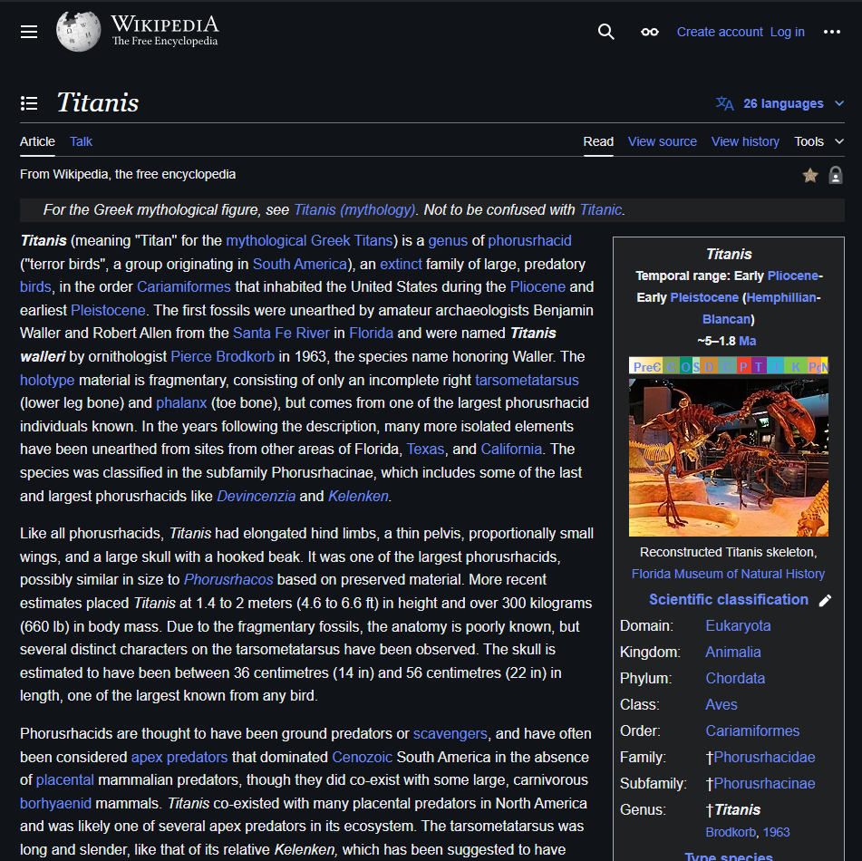

# Simplify-Wiki-Extension

a simple chrome extension to simplify the wiki design for better readablility.

## How to use ?

-> Download the zip file of this repo.
-> Open chrome and go to extension settings.
-> Enable developer mode and load the folder to the settings.
-> Enjoy the minimal UI of the new simple wiki.

## Screenshots:

